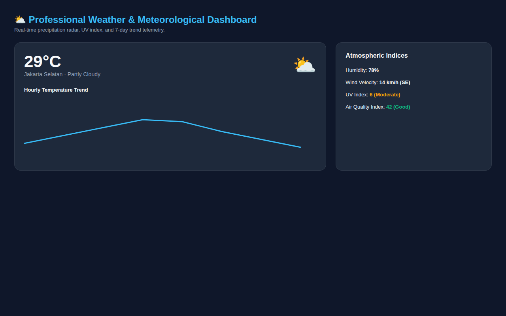

  

  # Professional Weather Dashboard

  This is a code bundle for Professional Weather Dashboard. The original project is available at https://www.figma.com/design/GRAx2BuD1XoDVfcXLNuZ4q/Professional-Weather-Dashboard.

  ## Running the code

  Run `npm i` to install the dependencies.

  Run `npm run dev` to start the development server.
  