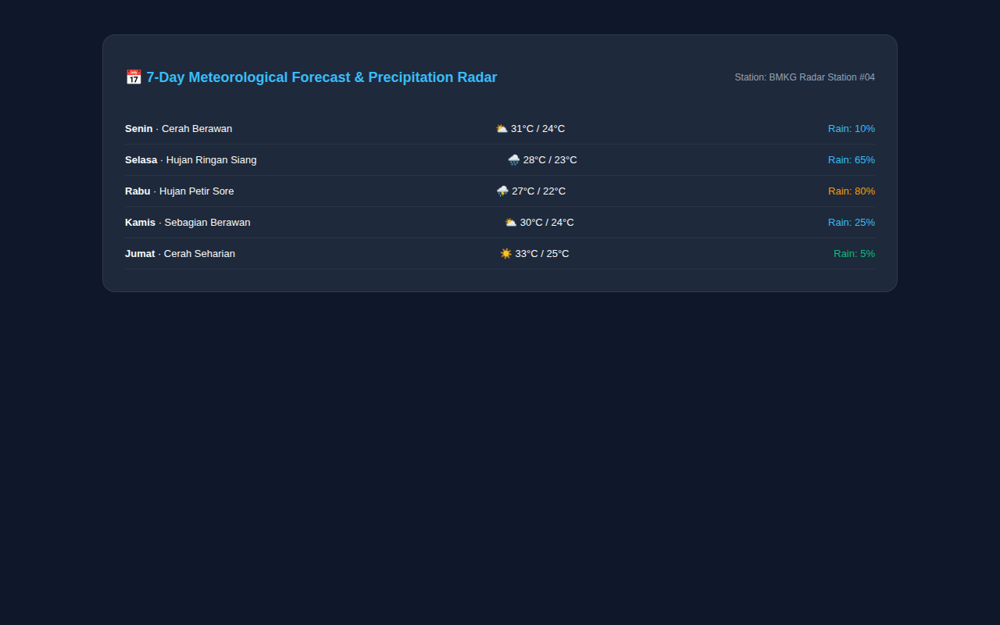

# ⛅ Meteorological Pulse — Professional Weather & Climate Dashboard

> **Interactive meteorological analytics platform featuring real-time precipitation radar, hourly temperature trends, and atmospheric UV/AQI telemetry.**

---

## 📸 Visual Showcase & Radar Trends

  

<em>Figure 1: Current weather cockpit with hourly temperature curve and atmospheric indices.</em>

 

  <table width="100%">
    <tr>
      <td width="100%" align="center">
        
         <strong>Figure 2: 7-Day Meteorological Trend Forecast</strong> 
        <em>Precipitation probability, high/low temperature spreads, and humidity forecasts.</em>
      </td>
    </tr>
  </table>

